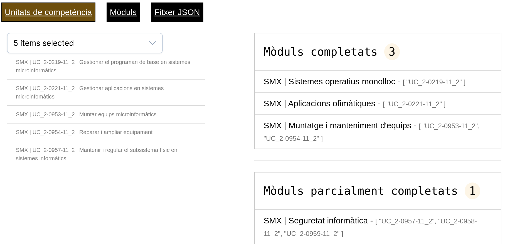
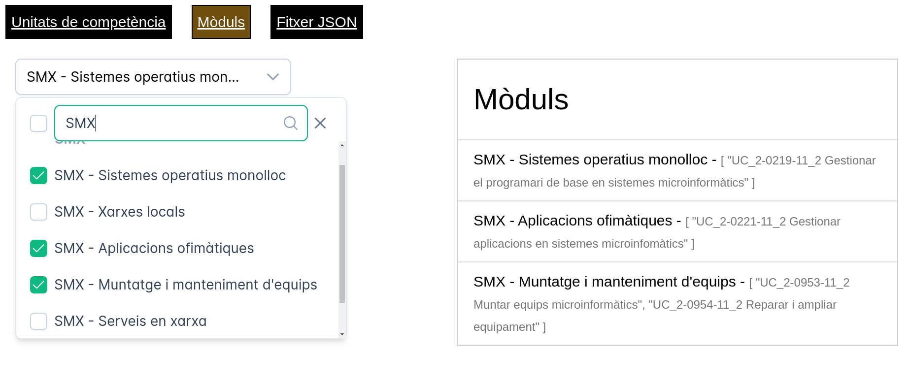
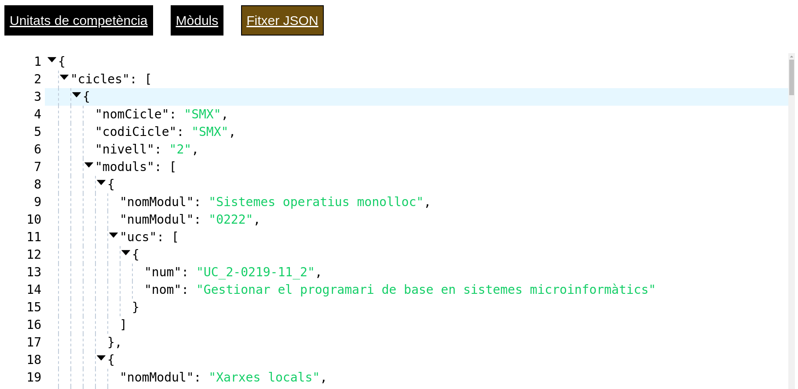

# UC->Mòduls

És una aplicació frontend que, a partir de la lectura d'un fitxer JSON estàtic allotjat al servidor, retorna els mòduls equivalents a les unitats de competència indicades en un desplegable. El desplegable d'unitats de competència integra un filtre que permet la cerca per cicle, nom de la competència o bé el seu número. 

Per aquesta facilitat a l'hora de localitzar competències i també mòduls (a l'opció del menú corresponent) és una eina de gestió administrativa a la vegada que d'orientació pedagògica.

L'aplicació indica els mòduls que queden completament convalidats per la selecció d'unitats de competència, així com aquells que resten parcialment convalidats.

Només requereix, per al seu desplegament, d'un servidor de pàgines web estàtiques, sense cap requeriment a nivell de llenguatge de programació servidor. El processament del fitxer JSON es duu a terme en el navegador client mitjançant JavaScript.

Un cop editat el fitxer JSON,  s'actualitza l'aplicació pujant-lo al servidor, per exemple mitjançant el protocol FTP, sense haver de desplegar de nou l'aplicació.
Donat que la informació que processa és pública, no requereix d'autenticació.

Es pot comprovar el seu funcionament (amb només alguns exemples de cicles) a [GitHub Pages](https://planetacomputer.github.io/uc-uf-vue/) i també en [aquesta web d'exemple](https://capfi.cat)

# Com arrencar un servidor web

  *L'aplicació no s'executarà fent doble clic sobre el fitxer index.html*. És necessari un servidor web.

  A [GitHub > Releases](https://github.com/planetacomputer/uc-uf-vue/releases/tag/prod) hi ha un fitxer en format zip, uc-modul, que conté la web estàtica, inclòs el fitxer editable JSON.
  
  Per posar en marxa un servidor web en un ordinador local. Un cop descomprimit el fitxer dist.zip, des de dins del directori dist:

`python3 -m http.server 9000`

En aquest cas, un cop arrencat correctament, es podrà visualitzar amb el navegador a [http://localhost:9000/](http://localhost:9000/)

# Comandes de desenvolupament

`npm run dev`

`npm run build`

# Comandes de GitHub Pages
`git add dist -f`

`git commit -m "adding dist base url"`

`git subtree push --prefix dist origin gh-pages`